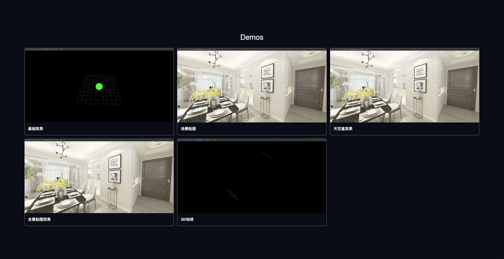

# Imber 3D 演示项目

一个基于 Three.js 的 3D 交互演示项目集合，包含多种 3D 效果和场景展示。



## 🚀 项目特性

- **多种 3D 效果演示**：包含基础效果、场景贴图、天空盒、全景贴图等
- **3D 看房功能**：实现沉浸式的房屋浏览体验
- **3D 地球展示**：交互式地球模型
- **动画效果**：包含跳舞动画等趣味演示

## 📁 项目结构

```
imber-3d/
├── app/                    # Next.js 主应用
│   ├── normal/            # 基础效果演示
│   ├── scene/             # 场景贴图（3D看房）
│   ├── sky-box/           # 天空盒效果（3D看房）
│   ├── circle-texture/    # 全景贴图效果（3D看房）
│   ├── earth/             # 3D地球
│   └── dance/             # 跳舞动画
├── 360-house-viewing-main/ # Vue 版本（360度看房）
├── components/            # 共享组件
├── public/               # 静态资源
└── lib/                  # 工具库
```

## 🛠️ 技术栈

### Next.js 版本

- **框架**: Next.js 14.2.3
- **3D 引擎**: Three.js 0.164.1
- **UI 组件**: Radix UI
- **样式**: Tailwind CSS
- **语言**: TypeScript

### Vue 版本

- **框架**: Vue 2.6.11
- **3D 引擎**: Three.js 0.135.0
- **动画**: GSAP 3.9.0
- **状态管理**: Vuex
- **路由**: Vue Router

## 🚀 快速开始

### Next.js 版本

1. **安装依赖**

   ```bash
   npm install
   # 或
   pnpm install
   ```

2. **启动开发服务器**

   ```bash
   npm run dev
   # 或
   pnpm dev
   ```

3. **构建生产版本**
   ```bash
   npm run build
   npm run start
   ```

### Vue 版本

1. **进入 Vue 项目目录**

   ```bash
   cd 360-house-viewing-main
   ```

2. **安装依赖**

   ```bash
   npm install
   ```

3. **启动开发服务器**

   ```bash
   npm run serve
   ```

4. **构建生产版本**
   ```bash
   npm run build
   ```

## 📱 演示内容

### 🎯 基础效果 (`/normal`)

- Three.js 基础场景搭建
- 几何体渲染和材质应用
- 基础光照和阴影

### 🏠 3D 看房功能

- **场景贴图** (`/scene`): 使用立方体贴图实现室内场景
- **天空盒效果** (`/sky-box`): 全景天空盒展示
- **全景贴图** (`/circle-texture`): 360 度全景贴图效果

### 🌍 3D 地球 (`/earth`)

- 交互式地球模型
- 纹理贴图和光照效果
- 鼠标控制旋转和缩放

### 💃 跳舞动画 (`/dance`)

- 3D 角色动画
- FBX 模型加载
- 动画序列播放

## 🎮 交互控制

- **鼠标左键拖拽**: 旋转视角
- **鼠标滚轮**: 缩放场景
- **键盘控制**: 部分场景支持 WASD 移动

## 📦 依赖说明

### 核心依赖

- `three`: 3D 图形库
- `next`: React 全栈框架
- `vue`: 渐进式 JavaScript 框架
- `gsap`: 动画库（Vue 版本）

### 开发工具

- `typescript`: 类型安全
- `tailwindcss`: 原子化 CSS
- `eslint`: 代码检查

## 🔧 环境要求

- **Node.js**: >= 20.9.0
- **包管理器**: npm, pnpm 或 yarn

## 📄 许可证

本项目仅供学习和演示使用。
