> Document, Paragraph, Text 这三个是必须使用的，[starter-kit](https://tiptap.dev/docs/editor/api/extensions/starter-kit) 自带而且不需要样式，HardBreak 强制换行没有用，[History](https://tiptap.dev/docs/editor/api/extensions/history) 支持历史纪录可以撤回和还原

## 标题

先用 input，后续可能优化，有字符限制

## h1、h2、h3 正文字号设计、主题切换

参考 [heading](https://tiptap.dev/docs/editor/api/nodes/heading)，[shadcn Typography](https://ui.shadcn.com/docs/components/typography)、[tailwindcss-typography](https://github.com/tailwindlabs/tailwindcss-typography) 插件给 `markdown` 加样式，用 [next-themes](https://ui.shadcn.com/docs/dark-mode/next) 实现主题切换

## 引用

[blockquote](https://tiptap.dev/docs/editor/api/nodes/blockquote)

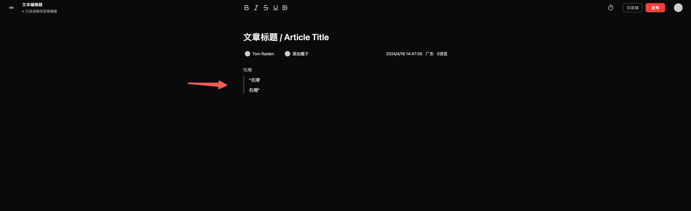

## 无序列表

[bulletList](https://tiptap.dev/docs/editor/api/nodes/bullet-list)，[list-item](https://tiptap.dev/docs/editor/api/nodes/list-item) 其中 `list-item` 也是必要的，是每一个 `item`，`bulletList` 是整个无序列表

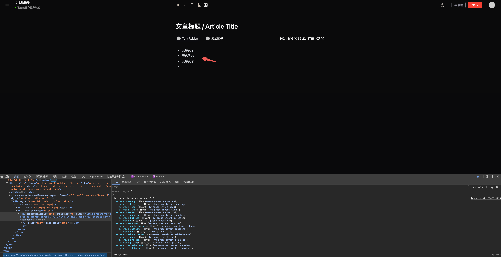

## 代码块

[CodeBlock](https://tiptap.dev/docs/editor/api/nodes/code-block)，注意黑色模式下颜色不对，最好自定义多一个变量来控制背景颜色。

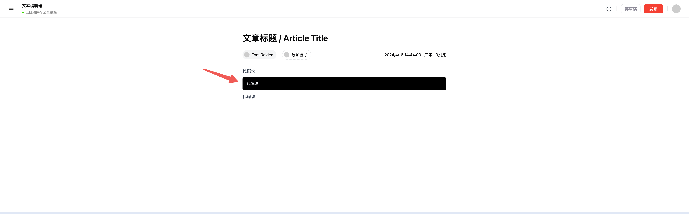

## 分割线

[horizontal-rule](https://tiptap.dev/docs/editor/api/nodes/horizontal-rule)，快捷方法是`***`

## 有序列表

[OrderedList](https://tiptap.dev/docs/editor/api/nodes/ordered-list)，同理也需要 `list-item`

## 加粗

[Bold](https://tiptap.dev/docs/editor/api/marks/bold)

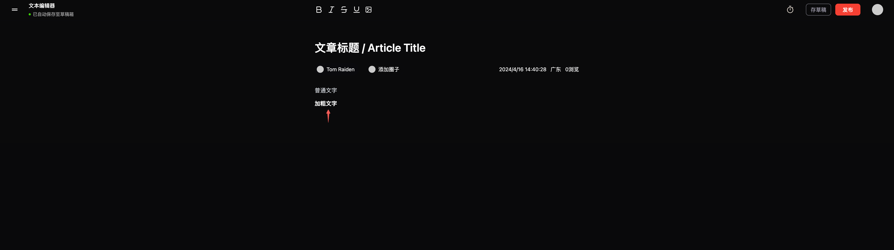

## 代码

[Code](https://tiptap.dev/docs/editor/api/marks/code)

TODO:...有 bug ，待开发

## 斜体

[ Italic](https://tiptap.dev/docs/editor/api/marks/italic)

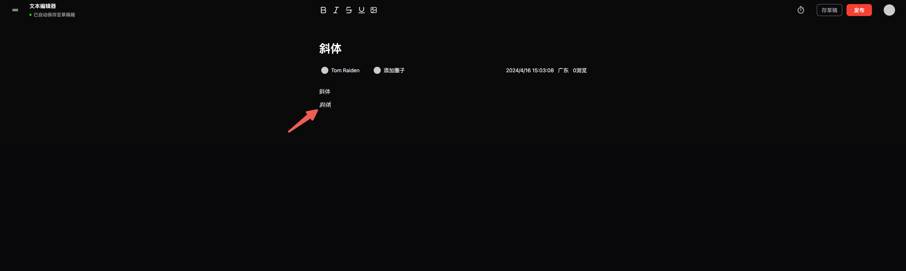

## 删除线

[Strike](https://tiptap.dev/docs/editor/api/marks/strike)

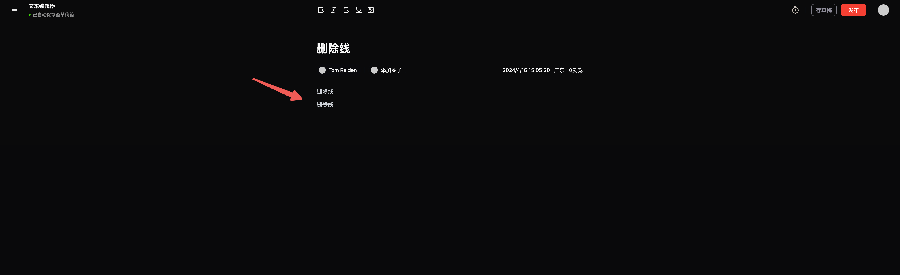

## 拖拽光标

[Dropcursor](https://tiptap.dev/docs/editor/api/extensions/dropcursor)，某些内容被拖入编辑器时，该插件会在放置位置显示光标。

## 间隙光标（从这里到上面所有功能都是 stater-kit 包含的功能）

TODO:黑色模式光标有问题，后续可能不要这个功能改为点击空白区域增加段落

[Gapcursor](https://tiptap.dev/docs/editor/api/extensions/gapcursor)，如果最后一个元素不是段落，比如图片这种，一种处理方案是加一个段落；目前是这种间隙光标，点击元素下方，可以出现横着的光标

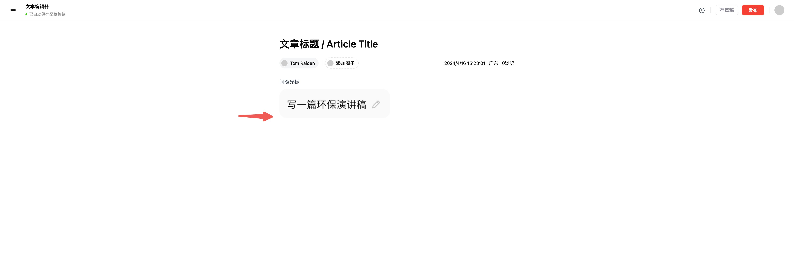

## 占位符

[Placeholder](https://tiptap.dev/docs/editor/api/extensions/placeholder#placeholder)

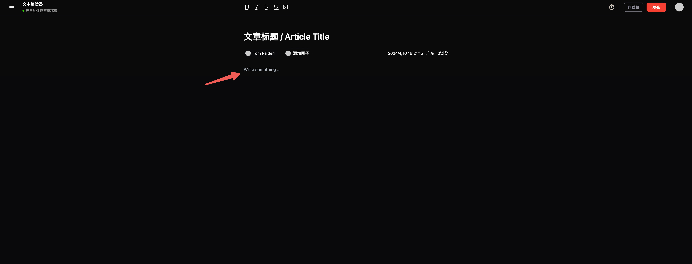

## 下划线

[Underline](https://tiptap.dev/docs/editor/api/marks/underline)

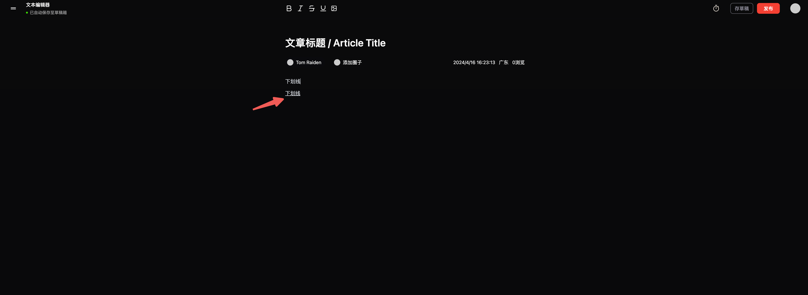

## 气泡栏

[Bubble Menu](https://tiptap.dev/docs/editor/api/extensions/bubble-menu) 基于 [tippyjs](https://atomiks.github.io/tippyjs/)

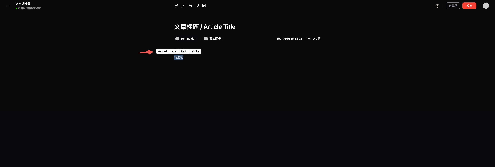

## 任务列表

[TaskList](https://tiptap.dev/docs/editor/api/nodes/task-list)

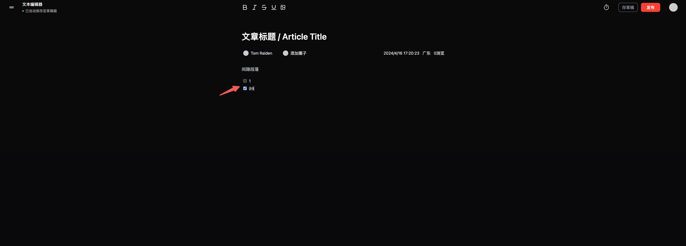

## 对齐方式

[TextAlign](https://tiptap.dev/docs/editor/api/extensions/text-align)

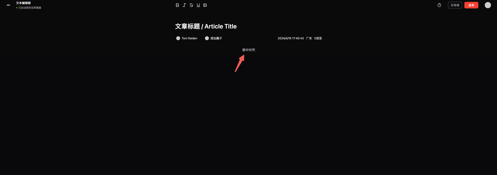

## 上下标

[Superscript](https://tiptap.dev/docs/editor/api/marks/superscript)[、Subscript](https://tiptap.dev/docs/editor/api/marks/subscript)

## 文字颜色

[Highlight](https://tiptap.dev/docs/editor/api/marks/highlight)

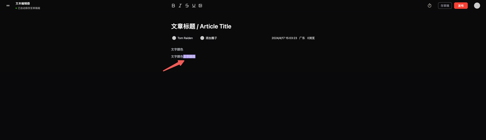

## Slash Command

[Slash Command](https://tiptap.dev/docs/editor/experiments/commands)，这是个实验性功能，需要参考 [suggestion](https://tiptap.dev/docs/editor/api/utilities/suggestion) 和 [tiptap-templates](https://templates.tiptap.dev/RF98Ccw8tn)

## Column 支持左右排列

自定义的插件，参考 [schema](https://tiptap.dev/docs/editor/api/schema)、[custom-extensions](https://tiptap.dev/docs/editor/guide/custom-extensions)

踩坑：不能使用 `tiptap-markdown`，会有冲突

## 超链接

[Link](https://tiptap.dev/docs/editor/api/marks/link)

## AI 功能 🔥

## Image 上传

参考[Image](https://tiptap.dev/docs/editor/api/nodes/image)，并加上可以修改图片的气泡框，这里后序还是自定义插件`imageBlock`，体验会更好

## 图片拖拽上传

需要手写 `imageUploader` 插件和拖拽上传逻辑

## 图片拖入编辑器中即可上传

[file-handler](https://tiptap.dev/docs/editor/api/extensions/file-handler)，pro extension 需要设置 [npm 代理](https://cloud.tiptap.dev/pro-extensions)，免费，记得 `gitignore`

## 拖拽排序

`@tiptap-pro/extension-drag-handle-react`

## 表格

[@tiptap/extension-table @tiptap/extension-table-row @tiptap/extension-table-header](https://tiptap.dev/docs/editor/extensions)，这个 `@tiptap/extension-table-cell` 从新定义了

