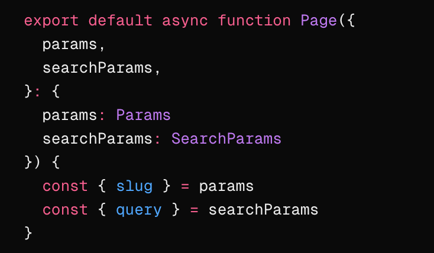

import Image from 'next/image'

## 基于 Tailwind 的响应式布局（含图片深入理解）

- [Tailwind - responsive-design](https://tailwindcss.com/docs/responsive-design)
- [Nextjs - Image Optimization](https://nextjs.org/docs/app/getting-started/images)
- [Nextjs - Image](https://nextjs.org/docs/app/api-reference/components/image)
- [MDN - Responsive images](https://developer.mozilla.org/en-US/docs/Web/HTML/Guides/Responsive_images)

### 响应式布局

如上篇文章所说的，响应式布局和自适应布局的区别，这里不再赘述

响应式布局：

- 根据屏幕大小自动调整布局
- 使用媒体查询，单位基本只需要使用 px
- 使用 flex,grid,百分比布局
- 需要特别注意的是 tailwind 中需要移动端优先

<video src="/posts/responsive/media2.mov" controls />

### 移动端优先

无前缀的类名（如 uppercase）对所有屏幕大小都有效，而带前缀的类名（如 md：uppercase）仅在指定的断点及以上处生效。

开发的时候应该先做移动端，然后做 PC 端，因为 PC 端会覆盖移动端样式

### Tailwind 常用响应式布局的类名

sm、md、lg、xl、2xl 是 Tailwind 的响应式断点，分别对应 640px、768px、1024px、1280px、1536px

min-[320px]:text-center 使用断点任意值，表示在 320px 及以上的屏幕上，text-center 类名生效

container 类名表示内容区域被限制在容器内，不会超出容器边界，
它表示容器，跟 padding 一起用断点的时候不会很生硬，外层也加一层元素会控制样式更加灵活


```css
.container {
  width: 100%;
  @media (width >= 40rem /* 640px */) {
    max-width: 40rem /* 640px */;
  }
  @media (width >= 48rem /* 768px */) {
    max-width: 48rem /* 768px */;
  }
  @media (width >= 64rem /* 1024px */) {
    max-width: 64rem /* 1024px */;
  }
  @media (width >= 80rem /* 1280px */) {
    max-width: 80rem /* 1280px */;
  }
  @media (width >= 96rem /* 1536px */) {
    max-width: 96rem /* 1536px */;
  }
}
```

### Nextjs 图片 🔥

Nextjs 中图片有三种存放的方式（Nextjs 官网谈到两种，但还是区分三种比较好）

1、 第一种本地图片：放到 public 文件夹，使用的时候 `src='/demo.png'`

```tsx
<Image src="/avatar.jpg" alt="test" width={100} height={100} />
```


- 必须要给 width 和 height（或者 fill），width 和 height 和图片真实宽高无关，所以只有比例关系有用，但是还是每个图片外都给一个 div 设置宽高，防止意外情况，比如 gsap 动画计算就一定需要宽高，(如果父级不加宽高，图片的显示大小就是设置的 width 和 height，但不要这样做)
- 图片会自动转 webp 格式
  
- 自动设置 loading="lazy"，支持图片懒加载; decoding="async"，支持图片异步解码
- 如果图片在首屏可见，nextjs 会提示添加 priority 属性，和不加的区别是没有 loading="lazy" 属性
  
  
- 图片的 srcset 属性，可以设置图片的响应式，在电脑上清晰度比较低的显示器才是 1，手机屏幕往往比较高，都会大于 2 ,这里的 w=256 跟我设置的 width={100} height={100} 有关，可以理解为二倍图，跟 [devicesizes](https://nextjs.org/docs/app/api-reference/components/image#devicesizes) 配置有关；w=256 表示图片的宽度是 256px，q=75 表示图片的质量是 75%，跟 [quality](https://nextjs.org/docs/app/api-reference/components/image#qualities) 配置有关

```text
srcset="/_next/image?url=%2Favatar.jpg&w=128&q=75 1x,
        /_next/image?url=%2Favatar.jpg&w=256&q=75 2x"
```


2、 第二种本地图片：放到 app 文件夹，通过模块导入使用，这种方式和第一种差不多，只是不需要给 width 和 height，nextjs 会获取原图的尺寸来自动设置

```tsx
import DemoImage from './images/avatar.jpg'

const Test = () => {
  return <Image src={DemoImage} alt="test" />
}

export default Test
```


这种方案还适合做图片渐进式加载，也就是可以加 placeholder="blur" 属性，在图片加载之前显示一个模糊的占位符，加载完成之后再显示真实的图片

```text
<Image src={DemoImage} alt="test" placeholder="blur" />
```


<video src="/posts/responsive/media9.mov" controls />

3、 第三种是远程图片链接，使用的时候 `src='https://example.com/demo.png'`，为了安全，需要 [remotePatterns](https://nextjs.org/docs/app/api-reference/components/image#remotepatterns) 配置，也是必须设置 width 和 height（或者 fill），功能同第一种，远程图片也可以使用 `placeholder="blur"`，
`blurDataURL=base64` 来做一个渐进加载，这种方案只会多加载一张图，不会像小红书一样多加载很多图片请求，因为小红书是把每张图都做对应渐进加载，而不是同一张图


远程图片很常见的还有在不定宽高的时候，使用 fill 结合 sizes 属性，来实现 [图片的响应式](#图片响应式)

思考：那什么时候用第一种，第二种，第三种呢？

- 第一种：如果图片是本地图片，图片是静态资源，不需要经过打包处理，直接通过 URL 访问即可；适合做静态资源托管，比如 logo、icon、banner 等不会频繁变动的图片；适合需要 CDN 加速的场景，因为 public 下的文件会原样输出到最终的静态资源目录，便于 CDN 缓存和分发；适合 SEO 相关的图片，路径固定，容易被搜索引擎收录。
- 第二种：需要利用 Next.js 的图片优化能力（如自动尺寸、渐进式加载、自动格式转换等）；图片和组件/页面强关联，属于组件私有资源（如头像、局部装饰图）；需要自动获取图片原始尺寸，减少手动维护宽高；需要用到 Next.js 的图片占位符（blurDataURL）等高级特性；
- 如果图片是远程图片，使用第三种

拓展：超有用的图片属性

```ts
const nextConfig = {
  images: {
    // 设置图片的下载方式，也就是只能下载，无法通过 url 打开，这样不会浪费自己服务器资源
    contentDispositionType: 'attachment',
    // 设置图片的 CSP，可以避免图片携带脚本攻击
    contentSecurityPolicy: "default-src 'self'; script-src 'none'; sandbox;"
  }
}
```

因为本篇文章多数是用 md 语法，没有上面两个功能，所以下面这张图片使用的 nextjs 的 Image 组件来测试，右键在新标签中打开图片就可以看到效果，会直接下载图片

<div className="w-full">
  <Image src="/posts/responsive/image11.png" alt="test" width={1280} height={1280} />
</div>

记录遇到的坑：做营销活动海报的库 html2canvas 和 Image 标签一起使用可能会有兼容性问题

### Webp 的兼容性

方案一：在有服务端能力的情况下，比如阿里云 OSS，Nextjs，它们会根据 Accept 这个请求头来判断是否返回 webp（推荐）


方案二：原生 picture 标签

```html
<picture>
  <source srcset="image.webp" type="image/webp" />
  <source srcset="image.png" type="image/png" />
  
</picture>
```

方案三：JS 脚本 （不推荐）

```js
function checkWebPSupport() {
  let canvas = document.createElement('canvas')
  if (canvas.toDataURL) {
    return canvas.toDataURL('image/webp').indexOf('data:image/webp') === 0
  }
  return false
}
```

### 图片响应式 🔥

背景：响应式的项目，在大屏的时候应该加载大图，小屏的时候应该加载小图。如果在小屏幕加载了一张很大的图，那会浪费资源；如果在大屏幕加载了一张很小的图，那看起来有颗粒感；更复杂的是，某些设备具有高分辨率屏幕，需要比预期的更大的图像才能很好地显示。下面只讨论 html 方案，背景图方案参考 [Responsive images 101 - part 8: CSS images](https://cloudfour.com/thinks/responsive-images-101-part-8-css-images/)

1、同一图片的响应式（sizes srcset）

对于同一图片来说，可以使用 sizes 和 fill 属性（fill 属于 nextjs 的 Image 组件的属性，nextjs 做同一图片的响应式更加方便），只需要提供一张大图，然后这两个属性可以控制图片的显示方式，通过这种方式就能实现图片的响应式

当远程图片(或者本地图片) width height 不确定的时候，可以使用图片的 fill 属性，它使图像扩展到父元素的大小，并且可以看到图片会有个 absolute 属性，所以父元素必须 “relative”， “fixed”， “absolute”，然后图片可以设置 objectFit 属性，来控制图片的显示方式。

```jsx
<Image
  src="https://img.res.meizu.com/img/download/uc/17/35/38/56/70/173538567/w200h200"
  alt="test"
  fill
  sizes="100vw"
  objectFit="cover"
/>
```

```jsx
<div className={'relative size-10'}>
  <Image
    src="/avatar.jpg"
    fill
    sizes="(max-width: 768px) 100vw, (max-width: 1200px) 50vw, 33vw"
    alt="test"
    objectFit="cover"
  />
</div>
```

对于 [sizes](https://nextjs.org/docs/app/api-reference/components/image#sizes) 和 srcset 属性，sizes 属性是用来设置图片的尺寸，srcset 属性是用来设置图片的源，这两个属性是用来控制图片的显示方式。

注意 Nextjs 对图片处理缩小是可以的，但是放大不行，所以下面的比如匹配上了 3840，但是原图最大宽度只有 200，那也只是显示 200 的图，不会放大

100vw 计算规则大约为视窗宽度（如 800px） \* DPR（如 2） → 需要 1600px 物理宽度的图片，所以会匹配到 1920 的图片；`(max-width: 768px) 100vw, (max-width: 1200px) 50vw, 33vw` 表示在 768px 及以下的屏幕上，图片的宽度为 100vw，在 1200px 及以下的屏幕上，图片的宽度为 50vw，在 1200px 及以上的屏幕上，图片的宽度为 33vw，也就是平板的时候要 \* 1/2 ，pc 的是 \* 1/3

```text
sizes="100vw"

srcset="
  /_next/image?url=...&w=640&q=75 640w,
  /_next/image?url=...&w=750&q=75 750w,
  /_next/image?url=...&w=828&q=75 828w,
  /_next/image?url=...&w=1080&q=75 1080w,
  /_next/image?url=...&w=1200&q=75 1200w,
  /_next/image?url=...&w=1920&q=75 1920w,
  /_next/image?url=...&w=2048&q=75 2048w,
  /_next/image?url=...&w=3840&q=75 3840w
"
```


2、不同图片（为不同布局提供裁剪图像）的响应式（picture）

通过 media 属性，来判断屏幕大小，然后提供不同的图片，来实现图片的响应式

<Sandpack>

```js
export default function App() {
  return (
    <picture style={{ width: '100px', height: '100px' }}>
      <source
        media="(max-width: 799px)"
        srcset="https://ssm.res.meizu.com/admin/2023/10/30/1277278717/zLSkr3lTD0.png"
      />
      <source
        media="(min-width: 800px)"
        srcset="https://ssm.res.meizu.com/admin/2022/10/18/1780834568/xfMvystede.jpg"
      />
      
    </picture>
  )
}
```

</Sandpack>

### 响应式布局

1、规则的响应式布局

<video src="/posts/responsive/media2.mov" controls />

对于规则的布局，可以使用 flex，grid 布局，来实现图片的响应式，上面的代码就是 grid 布局，注意的是外层有一个 container，里面的图片需要定好宽高比

<Sandpack>

```js
export default function App() {
  const arr = Array(6).fill({
    src: 'https://ssm.res.meizu.com/admin/2022/10/18/1780834568/xfMvystede.jpg',
    alt: '测试图片'
  })

  return (
    <div
      className="container mx-auto grid gap-4 xl:gap-6"
      style={{ gridTemplateColumns: 'repeat(auto-fill,minmax(320px,1fr))' }}
    >
      {arr.map((item, index) => (
        <div className="aspect-square">
          
        </div>
      ))}
    </div>
  )
}
```

```css
.container {
  width: 100%;
  margin-left: auto;
  margin-right: auto;
  padding-left: 1rem;
  padding-right: 1rem;
}

@media (min-width: 640px) {
  .container {
    max-width: 640px;
  }
}

@media (min-width: 768px) {
  .container {
    max-width: 768px;
  }
}

@media (min-width: 1024px) {
  .container {
    max-width: 1024px;
  }
}

@media (min-width: 1280px) {
  .container {
    max-width: 1280px;
  }
}

.mx-auto {
  margin-left: auto;
  margin-right: auto;
}

.grid {
  display: grid;
}

.gap-4 {
  gap: 1rem;
}

.xl\:gap-6 {
  @media (min-width: 1280px) {
    gap: 1.5rem;
  }
}

.aspect-square {
  aspect-ratio: 1 / 1;
}

.h-full {
  height: 100%;
}

.w-full {
  width: 100%;
}

.object-cover {
  object-fit: cover;
}
```

</Sandpack>

```js
<div className="grid grid-cols-1 gap-4 md:grid-cols-2 xl:grid-cols-3 xl:gap-6"></div>

// 或者
<div className="grid grid-cols-[repeat(auto-fill,minmax(400px,1fr))] gap-4 xl:gap-6"></div>
```

2、不规则的响应式布局

有时候，h5 和 pc 相差太大，基本无法改变布局来实现，所以最好的方案是使用自适应布局 + 媒体查询，低于 768 或者 1024 或者 1280 使用自适应布局，大于 1280px 使用 pc 布局
