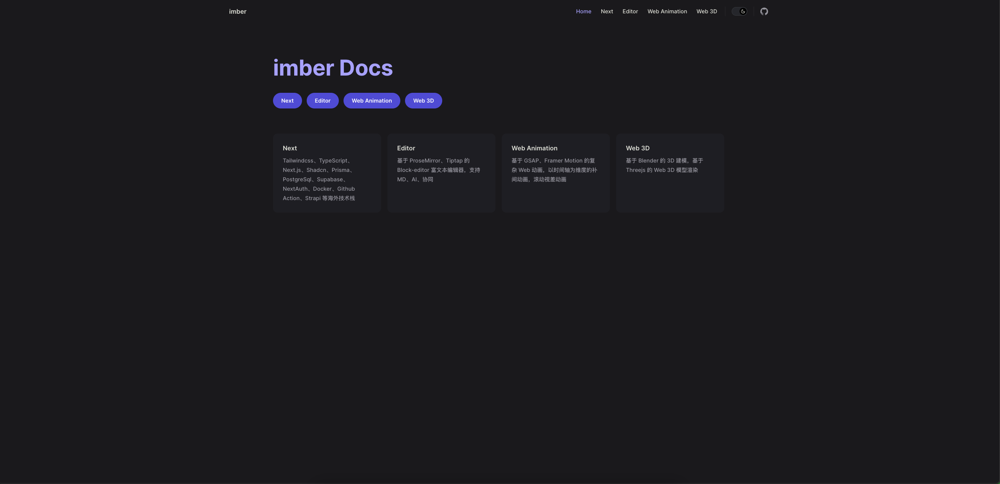

# Imber Docs

> 基于 VitePress 的现代化技术文档站点

## 📖 项目介绍

这是一个综合性的前端技术文档项目，涵盖了现代 Web 开发的核心技术栈。通过 VitePress 构建，提供快速、响应式的文档阅读体验。

**在线访问：** [https://imber.netlify.app/](https://imber.netlify.app/)



## ✨ 技术亮点

### 🚀 Next.js 全栈开发

- **前端框架：** Next.js 14 + TypeScript
- **样式方案：** Tailwind CSS + Shadcn/ui
- **数据库：** Prisma + PostgreSQL + Supabase
- **认证系统：** NextAuth.js
- **部署方案：** Docker + GitHub Actions

### 📝 富文本编辑器

- **核心引擎：** ProseMirror + Tiptap
- **功能特性：** Block-editor 架构
- **智能功能：** AI 辅助写作
- **协作能力：** 实时协同编辑
- **格式支持：** Markdown 原生支持

### 🎨 Web 动画系统

- **动画库：** GSAP + Framer Motion
- **动画类型：** 时间轴补间动画
- **视觉效果：** 滚动视差动画
- **性能优化：** 硬件加速渲染

### 🎯 Web 3D 渲染

- **建模工具：** Blender 3D 建模
- **渲染引擎：** Three.js
- **交互体验：** 3D 模型展示
- **在线演示：** [https://imber-frontend.netlify.app/3d/](https://imber-frontend.netlify.app/3d/)

## 🛠️ 技术栈

| 分类         | 技术选型                |
| ------------ | ----------------------- |
| **文档框架** | VitePress               |
| **前端框架** | Next.js 14, React 18    |
| **开发语言** | TypeScript              |
| **样式方案** | Tailwind CSS, Shadcn/ui |
| **数据库**   | PostgreSQL, Prisma ORM  |
| **认证**     | NextAuth.js             |
| **部署**     | Docker, GitHub Actions  |
| **编辑器**   | ProseMirror, Tiptap     |
| **动画**     | GSAP, Framer Motion     |
| **3D 渲染**  | Three.js, Blender       |

## 📁 项目结构

```
imber-docs/
├── animation/          # Web 动画相关文档
│   ├── gsap/          # GSAP 动画教程
│   └── fm/            # Framer Motion 教程
├── editor/            # 编辑器相关文档
│   ├── selection/     # 选择功能
│   ├── tiptap/        # Tiptap 集成
│   └── plugin/        # 插件开发
├── next/              # Next.js 相关文档
│   ├── next-project/  # 项目搭建
│   ├── next-auth/     # 认证系统
│   ├── prisma/        # 数据库集成
│   └── docker/        # 容器化部署
├── react/             # React 核心概念
└── note/              # 学习笔记
```

## 🚀 快速开始

### 环境要求

- Node.js >= 18.0.0
- pnpm >= 8.0.0

### 安装依赖

```bash
pnpm install
```

### 启动开发服务器

```bash
pnpm dev
```

### 构建生产版本

```bash
pnpm build
```

## 📝 Commit 规范

本项目遵循 [Conventional Commits](https://www.conventionalcommits.org/) 规范：

- `build`: 构建系统或外部依赖的更改
- `chore`: 其他不修改 src 或测试文件的更改
- `ci`: CI 配置文件和脚本的更改
- `docs`: 仅文档更改
- `feat`: 新功能
- `fix`: 错误修复
- `perf`: 性能优化
- `refactor`: 既不修复错误也不添加功能的代码更改
- `revert`: 回滚之前的提交
- `style`: 不影响代码含义的更改（空白、格式、缺少分号等）
- `test`: 添加缺失的测试或更正现有测试

## 📄 许可证

MIT License

## 🤝 贡献

欢迎提交 Issue 和 Pull Request 来改进这个项目！

---

⭐ 如果这个项目对您有帮助，请给它一个 Star！
